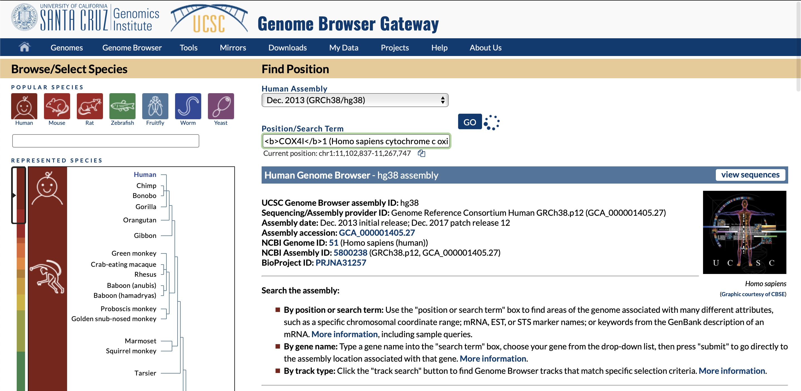
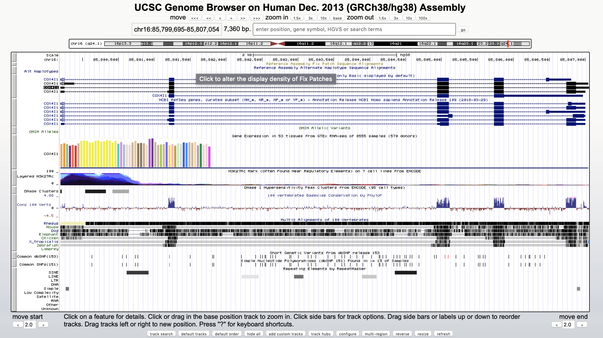
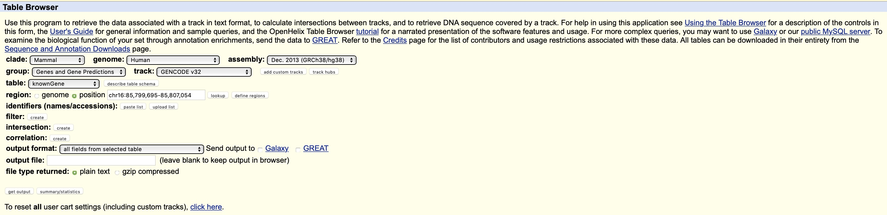

# UCSC

Il browser **UCSC** è un altro browser genomico molto diffuso, probabilmente più di ENSEMBL.  
Il sito per accedere a questo browser è: [http://genome.ucsc.edu](http://genome.ucsc.edu).  

Selezioniamo il **Genome browser** dalla lista **Our tools**. Nella casella `position` o `gene`  oltre alle coordinate genomiche si può inserire il nome del gene.  
La pagina risultante riporta tutti i geni in UCSC che corrispondono al nostro criterio di ricerca.  
Come si vede, è possibile ottenere informazioni relativamente a un intero cromosoma o a una regione specifica definendola sulla base delle coordinate, della vicinanza ad un marcatore, del contenuto informazionale, ecc.  
Proviamo a cercare **COX4I1**.  

Per il gene otteniamo un’ampia rappresentazione grafica delle caratteristiche relative alla regione genomica che lo contiene.  
Tra le informazioni riportate vi sono:  
* le posizioni degli esoni;  
* le regioni ipersensibili alla DNAsi;  
* la conservazione nell’ambito dei mammiferi;  
* la disponibilità di ortologhi;  
* gli elementi ripetuti;  
* le posizioni degli SNPs.

Se vogliamo estrarre delle specifiche informazioni per una data regione, possiamo selezionare la voce **“Table”** per 
selezionare il **"Table Browser"**.  

Ad esempio, possiamo estrarre le coordinate genomiche e le caratteristiche degli elementi genici (esoni, introni e CDS).  
Il formato normalmente utilizzato è un formato tabellare, importabile in Excel denominato `GTF`. Ma è anche possibile 
ottenere moltissime altre informazioni di vario genere.

[Programma Esercitazioni](../README.md) 

